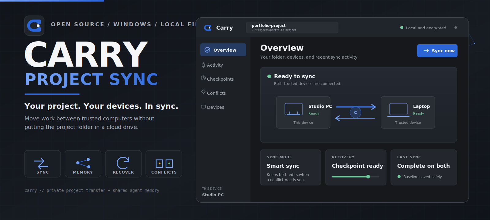

# Carry — Project Sync for Windows

<p align="center">
  
</p>

**Carry is an open-source Windows desktop app for syncing project folders and
shared AI-agent memory between trusted computers.**

Move your work between a PC and laptop without putting the entire project in a
cloud drive. Carry keeps both trusted copies in sync, including the useful
context your AI coding agents share.

> **Public preview:** Carry is ready for testing and feedback, but it is not a
> finished commercial product. Start with a test folder before trusting it with
> important work.

## Install and open Carry

### Option 1: Install the Windows app (recommended)

1. Open the [latest GitHub release](../../releases/latest).
2. Download `Carry-Setup-<version>-windows-x64.exe`.
3. Run the installer on both Windows devices.
4. Open **Carry** from the Start menu or Windows Search.

Preview installers are not digitally signed yet. Windows SmartScreen may show
an **Unknown publisher** warning. Check the download against the release's
`SHA256SUMS.txt` before running it.

### Option 2: Run it from the source code

Requirements: Windows x64, Git, and Node.js 22 or newer.

After cloning or downloading this repository, open PowerShell in the project
folder and run:

```powershell
npm ci --ignore-scripts
node .\scripts\prepare-native.js
node .\bin\carry.js app
```

Useful checks for developers:

```powershell
npm audit
npm run test:all
npm run build:windows
```

The Windows installer, portable ZIP, and checksum file are written to `dist/`.

## What Carry does

Carry is useful when you want to continue the same project on another trusted
computer without manually copying folders back and forth.

It can:

- Sync normal project files between Windows devices.
- Work on the same Wi-Fi or across different networks.
- Send additions, edits, deletions, and empty folders.
- Keep different edits from both devices when a conflict needs your decision.
- Create an automatic recovery checkpoint before replacing local work.
- Pause and reconnect a device without pairing it again.
- Sync [`shared-agent-memory`](https://github.com/dan-calin/shared-agent-memory)
  without one machine simply overwriting the other's notes.

Carry is not a replacement for Git. Git remains the right tool for commits,
branches, collaboration, and long-term project history. Carry ignores `.git/`,
so both tools can be used in the same folder.

## First-time setup

Install or open Carry on both devices, then select the folder each device
should use. The second device can start with a new empty folder.

### When both devices are on the same Wi-Fi

1. Open **Pair device** on the device that already has the project.
2. Choose **Show a code**, then **Generate pairing code**.
3. On the other device, choose **Enter a code** and paste the code.
4. When pairing completes, click **Sync now** on both devices.
5. Choose **Push** on the device with the project and leave the other device on
   **Smart sync**.
6. Wait until both devices say the sync is complete.

Windows may ask for permission to add Carry's local-network firewall rules the
first time. Approve that prompt on both devices.

### When the devices are on different networks

1. On the first device, open **Different network**.
2. Choose how many devices will be in the group and select **Create
   invitation**.
3. Send the complete invitation privately to the other person or device.
4. On the invited device, open **Different network**, paste the invitation,
   and select **Join invitation**.
5. Once both devices show as connected, click **Sync now** on either device.

The device that creates a team invitation acts as the group hub. It must remain
powered on, awake, online, and running Carry in the background while another
member syncs with it.

Closing the Carry window does not stop an active remote session. Open Carry
again from Windows Search to return to it. If both computers restart or the
remote session is stopped completely, create and join a new invitation once;
the saved device relationship and sync history remain available.

## Choosing the sync direction

Before syncing, Carry asks which copy should lead that exchange:

- **Push to [device]** makes the other folder match this device.
- **Pull from [device]** makes this folder match the other device.
- **Smart sync** exchanges ordinary one-sided changes and pauses when both
  devices changed the same file differently.

Push and Pull can replace files and carry deletions across. Carry creates a
recovery checkpoint on the receiving device before it makes those changes.

If you are unsure, choose **Smart sync**. Use Push or Pull when you deliberately
want one device's complete folder to be the source for that sync.

## Everyday use

1. Finish or pause your work on the current device.
2. Open Carry on the devices involved.
3. Select **Sync now**.
4. Review the chosen peer and direction.
5. Wait for **Sync complete on both devices** before continuing elsewhere.

For a same-Wi-Fi sync, start the sync on both devices. For an active
different-network session, starting it on one device wakes the other copy
automatically.

A successful exchange reports both **Peer applied our bundle** and **Saved the
last successful sync baseline**. If a connection is interrupted, retry the
sync; Carry does not mark an incomplete exchange as successful.

## Disconnect, reconnect, or forget a device

Open the **Devices** tab and select the device:

- **Disconnect device** pauses access but keeps the pairing key, history, and
  last successful sync information.
- **Connect device** re-enables that saved relationship without a new pairing
  invitation.
- **Forget device** permanently removes the local relationship and its saved
  key. Pair again with a fresh code or invitation if you later want it back.

Each device controls its own trust list. If both sides disconnected each
other, both sides need to reconnect. If either side forgot the relationship,
the devices need to pair again.

## Review shared agent memory

The **Memory** view keeps durable agent context separate from sync activity and
recovery history. Search the graph, select an item to inspect its observations,
source, and relations, then edit, pin, or delete it. Edits and deletions update
the standard `.shared-memory/memory.json` graph; Carry saves the prior graph as
`memory.json.bak`. Pins and device-of-arrival details are local display metadata
stored in Carry's private app data.

Shared memory currently converges by union. If you edit or delete something
that an unsynced device still holds, that older observation or item can return
on the next sync. Carry shows this warning before an edit or deletion.

Completed sync sessions list the exact memory items, observations, and
relationships they added. Selecting one opens the current Memory item with
matching additions highlighted and an **Added in this sync** badge. The Memory
view also offers **Review latest sync additions** for the newest completed
memory-changing session. Checkpoint previews separately show project-file and
shared-memory changes, including which memory items a restore would remove,
revert, or bring back.

## Conflicts and recovery

When both devices edit the same file differently, Carry does not silently pick
a winner. It keeps both conflict-time copies and shows the conflict in the app.
You can compare them and choose which version to keep.

The **Checkpoints** view lets you create a named restore point or restore an
earlier one. Carry also creates automatic checkpoints before an incoming sync
replaces project files or changes shared memory. If applying a multi-file
update fails, Carry attempts to roll the affected paths back to their pre-sync
state.

Checkpoints are local recovery tools, not Git commits or cloud backups. Keep a
separate backup for important work.

## Privacy and security in plain language

- Carry does not require a Carry account.
- There is no advertising or usage analytics in the app.
- Project contents and control messages are encrypted before relay transport.
- Pairing invitations and codes are credentials. Share them privately and do
  not include them in screenshots, issues, or commits.
- The relay can observe connection details such as IP addresses, timing, and
  traffic size, but it is not intended to store project files.
- Local pairing information, checkpoints, and activity history live in Carry's
  private app-data directory (`%LOCALAPPDATA%\Carry` on Windows), outside the
  selected project. Pairing credentials are encrypted for the current Windows
  user. Legacy `.carry` state is securely migrated when the project is opened.
- Shared AI-agent memory may live in `.shared-memory`, which is also ignored by
  this repository.

Read [PRIVACY.md](PRIVACY.md) for the full data explanation and
[SECURITY.md](SECURITY.md) before reporting a vulnerability.

## What this portfolio project demonstrates

Carry is part of the portfolio I am building to demonstrate practical AI
literacy and AI-driven software development.

I used AI as the primary coding tool while I directed and evaluated the work:
defining the problem, reviewing the code and issues, testing behaviour, and
deciding what was ready to keep. The goal was never to accept generated code
automatically. The project was shaped by repeatedly asking what could fail,
what could damage user work, and how each assumption could be tested.

The work demonstrates:

- Turning a real workflow problem into a usable product.
- Critical thinking about security, privacy, and failure cases.
- Redundant protection through encryption, checkpoints, rollback, integrity
  checks, and conflict preservation.
- Attention to accessibility, documentation, installation, and everyday user
  experience.
- Using automated tests and real release builds to verify AI-generated
  implementation.
- Preparing a project for public review and open-source contribution.

Feedback, questions, code review, usability observations, and constructive
criticism are welcome.

## Current preview limitations

- The packaged app currently supports Windows x64.
- Sync is manual rather than continuous.
- The Windows executables are unsigned and may trigger SmartScreen.
- The invitation creator is the hub for a remote team and must remain online.
- Remote team members sync with the hub one at a time; updates are not
  automatically broadcast to every member.
- Direct P2P remote transfer is experimental and off by default. Carry falls
  back to the encrypted relay when a direct connection is unavailable.
- Checkpoints remain until manually deleted and do not yet have an automatic
  retention limit.
- One exchange supports up to 5 GiB of changed file content. The complete
  project may be larger when the changes fit within that limit.
- Pairings made by older previews may use legacy keys that the hardened version
  refuses. Forget the old pairing and pair once with a fresh invitation.

## Command reference

Run commands from this repository with `node .\bin\carry.js`, or use `carry`
after installing the command globally in your own development environment.

| Command | Purpose |
| --- | --- |
| `node .\bin\carry.js app` | Open the desktop app |
| `node .\bin\carry.js app --folder PATH` | Open Carry with a specific folder |
| `node .\bin\carry.js setup` | Guided LAN pairing and first sync |
| `node .\bin\carry.js status` | Show this device and its saved peers |
| `node .\bin\carry.js sync` | Start an on-demand sync |
| `node .\bin\carry.js sync --direct` | Try experimental P2P, then use relay fallback |
| `node .\bin\carry.js help` | Show all terminal commands |

Common project commands:

| Command | Purpose |
| --- | --- |
| `npm ci --ignore-scripts` | Install the exact locked JavaScript dependencies |
| `node .\scripts\prepare-native.js` | Verify and prepare the pinned native transport |
| `npm audit` | Check installed JavaScript dependencies for known vulnerabilities |
| `npm run test:all` | Run the complete JavaScript and integration test matrix |
| `npm run test:security` | Run the focused security checks |
| `npm run test:lan` | Run the two-device LAN integration test |
| `npm run test:remote` | Run the encrypted remote-sync integration test |
| `npm run test:p2p` | Run native direct-transport checks |
| `npm run test:tauri` | Run the Rust desktop-shell tests |
| `npm run build:windows` | Build and validate the installer and portable ZIP |

## Building the Windows release

Building requires Windows x64, Node.js 22+, Rust, and the Visual C++ desktop
build tools.

```powershell
npm ci --ignore-scripts
node .\scripts\prepare-native.js
npm run test:all
cargo fmt --manifest-path .\src-tauri\Cargo.toml -- --check
cargo test --locked --manifest-path .\src-tauri\Cargo.toml
npm run build:windows
```

The release build validates the packaged runtime, native dependency, installer,
portable archive, update behaviour, uninstall behaviour, and final checksums.
GitHub Actions repeats these checks before publishing a tagged preview release.

## Relay development and self-hosting

The desktop app is configured to use the project's hosted encrypted relay for
different-network sessions. Fork maintainers can deploy the checked-in
Cloudflare Worker:

```powershell
npm ci
npx wrangler login --use-keyring
npm run relay:deploy
```

After deployment, replace `DEFAULT_HOSTED_RELAY_URL` in `lib/tunnel.js` with
the deployment URL and run the relay integration tests before distributing a
build. A public relay operator should publish who operates it and how connection
logs are retained.

An advanced temporary self-hosted route is also available:

```powershell
node .\bin\carry.js relay --tunnel
node .\bin\carry.js pair --relay "https://example.lhr.life/carry#complete-secret"
node .\bin\carry.js sync --relay "https://example.lhr.life/carry#complete-secret"
```

Treat the complete URL as a password because the fragment contains the private
invitation secret.

## Project structure

```text
app/               Desktop interface and visual assets
bin/               Command-line entry point
lib/               Pairing, sync, encryption, recovery, and app services
src-tauri/         Native Tauri window and Rust dependency lock
relay/             Optional self-hosted relay
cloudflare-relay/  Hosted Worker and connection limiter
scripts/           Native preparation, tests, installer, and release build
test/              Unit, integration, security, network, and package tests
```

## Contributing

Issues, questions, and pull requests are welcome. Start with
[CONTRIBUTING.md](CONTRIBUTING.md) for the development workflow and
[CODE_OF_CONDUCT.md](CODE_OF_CONDUCT.md) for community expectations.

Please report potential vulnerabilities privately through GitHub's security
reporting flow as described in [SECURITY.md](SECURITY.md). Do not publish real
pairing codes, invitation URLs, device identifiers, logs, or project contents.

## License

Carry is available under the [MIT License](LICENSE).
